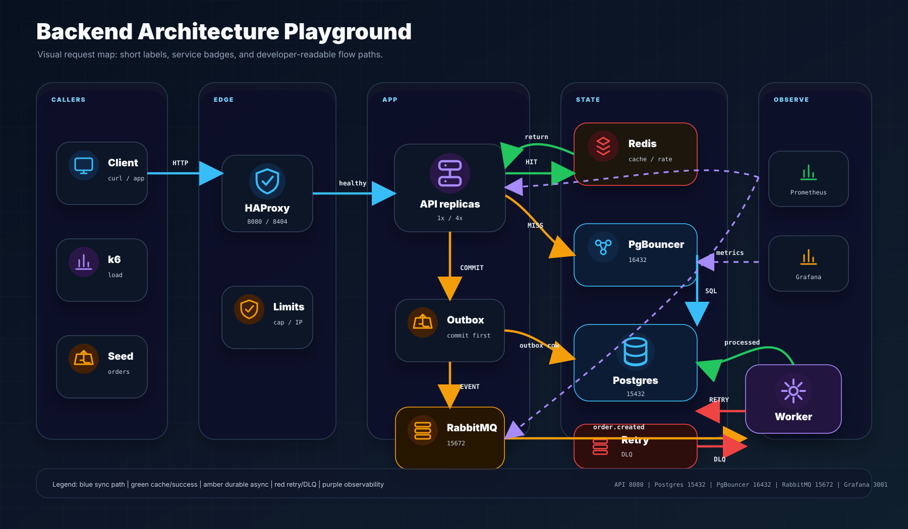
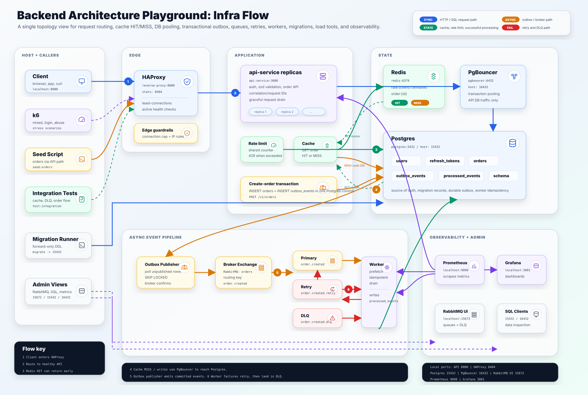

# Backend Architecture Playground

Backend Architecture Playground is a local-first Node.js backend lab for testing enterprise backend patterns under measurable load. The MVP uses a compact order-processing workload so the system can exercise auth, writes, reads, caching, queues, workers, graceful shutdown, migrations, and observability without turning into a product build.

## Architecture Maps

Start with the visual map when explaining the system quickly:



Use the detailed topology when checking exact services, tables, ports, and operational paths:



The current MVP runs through Docker Compose:

- `reverse-proxy`: HAProxy entrypoint with least-connections balancing, connection limiting, active health checks, and forwarded IP normalization.
- `api-service`: Fastify + TypeScript HTTP API for auth and orders.
- `pgbouncer`: transaction pooling between API replicas and Postgres.
- `postgres`: users, refresh tokens, orders, outbox events, migration records, and processed-event idempotency.
- `redis`: shared cache and distributed rate-limit counters.
- `outbox-publisher`: publishes committed Postgres outbox rows to RabbitMQ.
- `rabbitmq`: broker for `order.created` events, retry queue, and DLQ.
- `worker-service`: idempotent event consumer with prefetch-based backpressure.
- `prometheus` and `grafana`: metrics and dashboards.
- `stress-tests` and `integration-tests`: host-run validation tools.

## Documentation Map

| Need                                                       | Read                                                              |
| ---------------------------------------------------------- | ----------------------------------------------------------------- |
| Start the project locally                                  | [Development Guide](docs/development.md)                          |
| Container names, ports, and service map                    | [Stack Summary](STACK.md)                                         |
| Database access, migrations, schema changes, and seed data | [Database Guide](docs/database.md)                                |
| API smoke tests, integration tests, and k6 stress tests    | [Testing Guide](docs/testing.md)                                  |
| Logs, metrics, graceful shutdown, DLQ, and troubleshooting | [Operations Guide](docs/operations.md)                            |
| Local deployment, scaling, and AWS phase mapping           | [Deployment Guide](docs/deployment.md)                            |
| Version updates, dependency updates, and release checks    | [Versioning Guide](docs/versioning.md)                            |
| Architecture decisions with tradeoffs                      | [Architecture Decisions](docs/architecture/decisions.md)          |
| Request-flow explanation                                   | [Architecture Request Flow](docs/architecture/request-flow.md)    |
| API contract (OpenAPI 3.1)                                 | [docs/api/openapi.yaml](docs/api/openapi.yaml)                    |
| Architecture decision presentation                         | [PowerPoint Deck](docs/decks/backend-architecture-decisions.pptx) |

The root [ARCHITECTURE.md](ARCHITECTURE.md) remains the short commit-facing architecture entry point. The `.kiro/specs/backend-architecture-playground` files are working spec notes and are intentionally ignored from commits.

## Quick Start

Install dependencies:

```powershell
pnpm install
```

Start the MVP with one API replica:

```powershell
pnpm run stack:up -- --replicas 1
```

Start the MVP with four API replicas:

```powershell
pnpm run stack:up -- --replicas 4
```

`--replicas` accepts any integer in `[1, 16]`; HAProxy reserves 16 backend slots and marks unfilled ones DOWN until they're scaled up.

Stop the stack:

```powershell
pnpm run stack:down
```

Seed orders through the public API path:

```powershell
pnpm run seed:orders -- --orders 1000 --concurrency 25
```

Run the live integration harness:

```powershell
pnpm run test:integration
```

## Local Endpoints

| Endpoint                      | Use                                                               |
| ----------------------------- | ----------------------------------------------------------------- |
| `http://localhost:8080`       | API through HAProxy                                               |
| `http://localhost:8080/docs`  | Swagger UI for the OpenAPI 3.1 contract                           |
| `http://localhost:8404/stats` | HAProxy stats                                                     |
| `127.0.0.1:15432`             | Postgres SQL access                                               |
| `127.0.0.1:16432`             | PgBouncer SQL access                                              |
| `http://localhost:15672`      | RabbitMQ management, `playground` / `CHANGE_ME_RABBITMQ_PASSWORD` |
| `http://localhost:9090`       | Prometheus                                                        |
| `http://localhost:3001`       | Grafana, `admin` / `admin`                                        |

## Expected Verification

The current MVP should pass:

```powershell
pnpm run typecheck
pnpm run lint
pnpm run test
pnpm run test:integration
docker compose -f infra/docker-compose.yml config
```

`pnpm run test` runs the unit suites in each package (currently the `api-service` cache, idempotency, and pagination helpers). `pnpm run test:integration` requires the Docker Compose stack to be running. After pulling new schema changes, run `pnpm run migrate` against the live Postgres.

For full manual test steps and API request bodies, use the [Testing Guide](docs/testing.md).
